```{r setup}
library(dplyr)
library(readr)
library(plotly)
library(DT)

mr_screen    <- read_csv("data/STable1_full_MR_screen.csv",    show_col_types = FALSE)
master_ev    <- read_csv("data/STable_master_evidence.csv",    show_col_types = FALSE)
druggability <- read_csv("data/STable5_druggability.csv",      show_col_types = FALSE)
mediation    <- read_csv("data/STable4_mediation_integrated_evidence.csv",
                         show_col_types = FALSE)

mr_screen <- mr_screen |>
  mutate(
    log_or       = log(OR),
    neg_log_p    = -log10(pvalue),
    cancer_label = gsub("_GCST.*", "", cancer_outcome),
    hit_label    = if_else(FDR < 0.05, "FDR < 0.05", "Non-significant"),
    hover_text   = paste0(
      "<b>", protein, "</b>",
      "<br>Cancer: ", gsub("_GCST.*", "", cancer_outcome),
      "<br>OR: ",  round(OR, 3),
      "<br>P: ",   signif(pvalue, 3),
      "<br>FDR: ", signif(FDR, 3)
    )
  )

tier_pal <- c(T1 = "#dff0d8", T2a = "#d9edf7", T2b = "#fcf8e3", T2c = "#f5f5f5")

dt_opts <- function(extra = list()) {
  modifyList(
    list(pageLength = 20, dom = "Bfrtip",
         buttons = c("copy", "csv", "excel"),
         autoWidth = TRUE, scrollX = TRUE),
    extra
  )
}
```

::: {.callout-note appearance="minimal"}
**Study:** Multi-omic triangulation of circulating proteins identifies novel breast cancer causal candidates. 701 proteins screened using cis-pQTL instruments from FinnGen Olink (N = 619). 17 protein–cancer associations survived BH-FDR correction.
[View on GitHub](https://github.com/vijayachitrabio/multiomic-network-mr-cancer){target="_blank" .btn .btn-outline-primary .btn-sm}
:::

::: {.panel-tabset}

## Overview

:::: {.columns}
::: {.column width="45%"}

### Key findings

| Tier | Proteins | Evidence |
|------|----------|----------|
| **T1** | EFNA1, TNFRSF6B, ATRAID, FGF5, ABO | MR + dual coloc (ABF + SuSiE) |
| **T2a** | SNX15, PM20D1, UMOD | MR + ABF-only coloc |
| **T2b** | APOE, TSPAN8 | MR + partial coloc |
| **T2c** | 7 proteins | MR-supported |

: {.striped .hover tbl-colwidths="[12,40,48]"}

:::
::: {.column width="5%"}
:::
::: {.column width="50%"}

### Study design

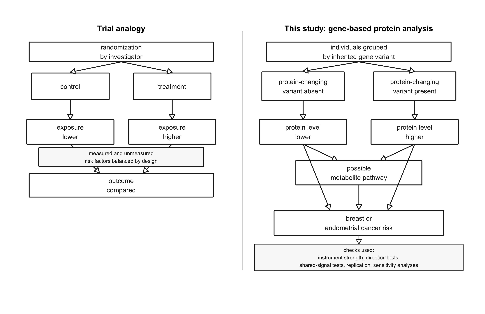{style="max-width:100%; border-radius:8px; box-shadow:0 4px 8px rgba(0,0,0,.12);"}

:::
::::

## MR Screen

> Volcano plot of the proteome-wide MR screen. **Colour = cancer outcome; filled circles = FDR < 0.05** (BH-corrected). Click legend entries to toggle cancers. X-axis = ln(OR) = β.

```{r volcano}
cancer_colors <- c(
  Breast        = "#d9534f",
  Endometrial   = "#5b9bd5",
  Ovarian       = "#70a558"
)

p <- plot_ly()

for (cx in unique(mr_screen$cancer_label)) {
  for (is_hit in c(FALSE, TRUE)) {
    d <- mr_screen |> filter(cancer_label == cx, (FDR < 0.05) == is_hit)
    if (nrow(d) == 0) next
    p <- p |> add_trace(
      data       = d,
      x          = ~log_or,
      y          = ~neg_log_p,
      type       = "scatter",
      mode       = "markers",
      name       = cx,
      legendgroup = cx,
      showlegend = !is_hit,
      text       = ~hover_text,
      hoverinfo  = "text",
      marker     = list(
        color   = cancer_colors[[cx]],
        size    = if (is_hit) 12 else 7,
        opacity = if (is_hit) 0.95 else 0.45,
        symbol  = if (is_hit) "circle" else "circle-open",
        line    = list(width = if (is_hit) 1.5 else 0.8,
                       color = cancer_colors[[cx]])
      )
    )
  }
}

p |> layout(
  xaxis  = list(title = "ln(OR)", zeroline = TRUE, zerolinecolor = "#bbb"),
  yaxis  = list(title = "-log10(p)"),
  legend = list(title = list(text = "Cancer outcome"),
                itemclick = "toggle", itemdoubleclick = "toggleothers"),
  height = 560
)
```

## Forest Plot

> All 17 FDR-significant protein–cancer associations. Sorted by tier then cancer. Hover for exact values.

```{r forest}
fp <- master_ev |>
  filter(!is.na(mr_or)) |>
  arrange(tier_short, cancer_mr, mr_or) |>
  mutate(
    label = paste0(protein, "  (", tier_short, " - ", cancer_mr, ")"),
    hover = paste0(
      "<b>", protein, "</b><br>",
      "Cancer: ", cancer_mr, "<br>",
      "Tier: ", tier_short, "<br>",
      "OR: ", round(mr_or, 3),
      " (", round(mr_or_lo, 3), "–", round(mr_or_hi, 3), ")<br>",
      "FDR: ", signif(mr_fdr, 3)
    )
  )
fp$label <- factor(fp$label, levels = fp$label)

cancer_col <- c(Breast = "#d9534f", Endometrial = "#5b9bd5", Ovarian = "#70a558")

plot_ly(fp,
        x = ~mr_or, y = ~label,
        type = "scatter", mode = "markers",
        color = ~cancer_mr, colors = cancer_col,
        error_x = list(type = "data", symmetric = FALSE,
                       array = ~mr_or_hi - mr_or,
                       arrayminus = ~mr_or - mr_or_lo),
        text = ~hover, hoverinfo = "text",
        marker = list(size = 11)) |>
  layout(
    xaxis  = list(title = "Odds ratio (95% CI)"),
    yaxis  = list(title = "", autorange = "reversed"),
    shapes = list(list(type = "line", x0 = 1, x1 = 1, y0 = 0, y1 = 1,
                       yref = "paper",
                       line = list(color = "#555", dash = "dash", width = 1))),
    legend = list(title = list(text = "Cancer")),
    margin = list(l = 210),
    height = 580
  )
```

## Colocalization

:::: {.columns}
::: {.column width="52%"}

### coloc.abf vs coloc.SuSiE

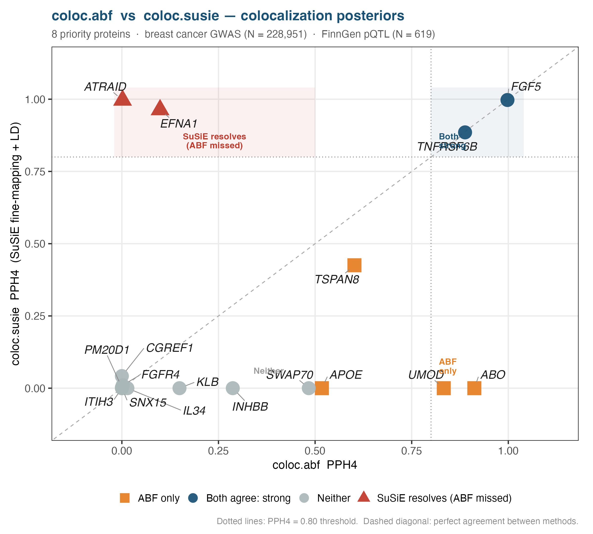{style="max-width:100%; border-radius:8px; box-shadow:0 4px 8px rgba(0,0,0,.12);"}

:::
::: {.column width="4%"}
:::
::: {.column width="44%"}

### PPH4 per protein

```{r coloc-table}
master_ev |>
  select(protein, cancer_mr, tier_short,
         coloc_PPH4_abf, coloc_PPH4_susie, coloc_verdict) |>
  arrange(tier_short, protein) |>
  datatable(
    rownames = FALSE,
    class    = "cell-border stripe hover compact",
    colnames = c("Protein", "Cancer", "Tier",
                 "PPH4 (ABF)", "PPH4 (SuSiE)", "Verdict"),
    extensions = "Buttons",
    options  = dt_opts(list(pageLength = 17, dom = "Bfrtip",
                            buttons = c("copy", "csv")))
  ) |>
  formatRound(c("coloc_PPH4_abf", "coloc_PPH4_susie"), digits = 3) |>
  formatStyle("tier_short",
              backgroundColor = styleEqual(names(tier_pal), unname(tier_pal)))
```

:::
::::

## ER Subtypes

:::: {.columns}
::: {.column width="50%"}

### ER-subtype forest plot

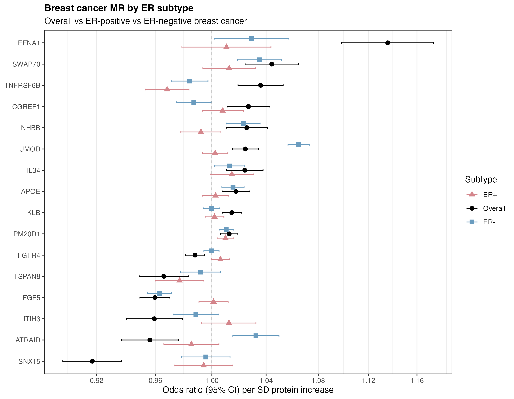{style="max-width:100%; border-radius:8px; box-shadow:0 4px 8px rgba(0,0,0,.12);"}

:::
::: {.column width="4%"}
:::
::: {.column width="46%"}

### ER+ vs ER− concordance

> Each point = one protein. Dotted diagonal = perfect concordance. Dashed lines = OR 1.

```{r er-scatter}
er <- master_ev |> filter(!is.na(or_ERpos) & !is.na(or_ERneg))
rng <- range(c(er$or_ERpos, er$or_ERneg), na.rm = TRUE)
pad <- diff(rng) * 0.08
lo  <- rng[1] - pad; hi <- rng[2] + pad

plot_ly(er,
        x = ~or_ERpos, y = ~or_ERneg,
        type = "scatter", mode = "markers+text",
        text = ~protein, textposition = "top center",
        hovertext = ~paste0(
          "<b>", protein, "</b><br>",
          "ER+: ", round(or_ERpos, 3), " (p=", signif(pval_ERpos, 2), ")<br>",
          "ER−: ", round(or_ERneg, 3), " (p=", signif(pval_ERneg, 2), ")"
        ),
        hoverinfo = "text",
        marker = list(size = 11, color = "#005b96", opacity = 0.85)) |>
  layout(
    xaxis  = list(title = "OR - ER positive", range = c(lo, hi)),
    yaxis  = list(title = "OR - ER negative", range = c(lo, hi)),
    shapes = list(
      list(type = "line", x0 = lo, x1 = hi, y0 = lo, y1 = hi,
           line = list(color = "grey", dash = "dot")),
      list(type = "line", x0 = 1, x1 = 1, y0 = lo, y1 = hi,
           line = list(color = "#aaa", dash = "dash", width = 1)),
      list(type = "line", x0 = lo, x1 = hi, y0 = 1, y1 = 1,
           line = list(color = "#aaa", dash = "dash", width = 1))
    ),
    height = 440
  )
```

:::
::::

## MAGMA

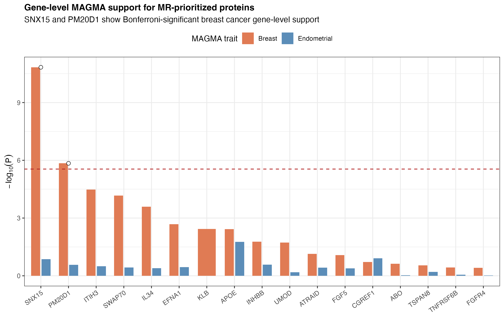{style="max-width:100%; border-radius:8px; box-shadow:0 4px 8px rgba(0,0,0,.12);"}

## Replication

::: {.panel-tabset}

### ARIC SomaScan

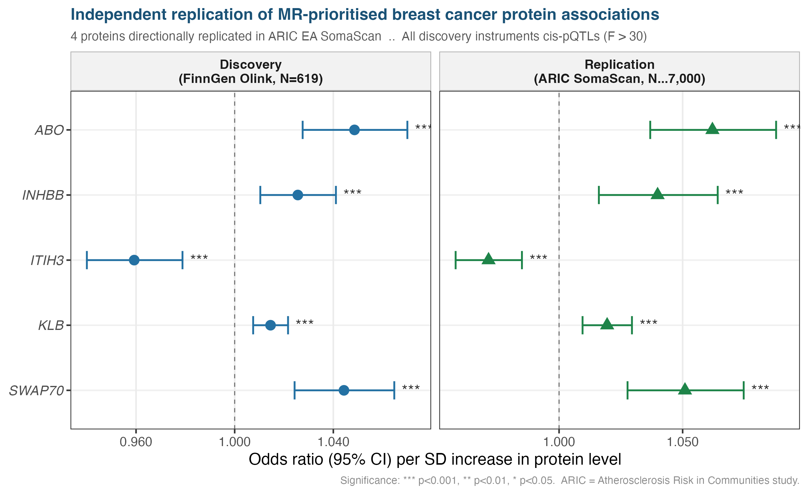{style="max-width:100%; border-radius:8px; box-shadow:0 4px 8px rgba(0,0,0,.12);"}

### OpenGWAS

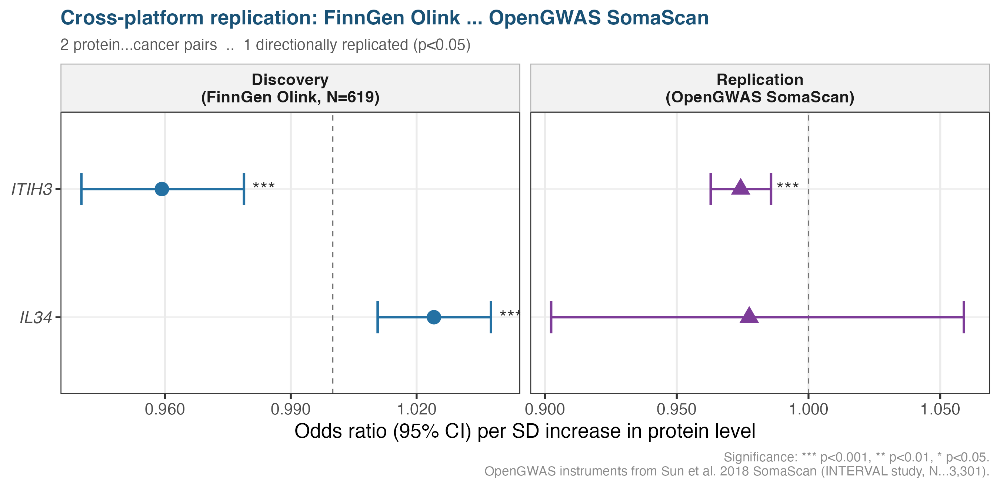{style="max-width:100%; border-radius:8px; box-shadow:0 4px 8px rgba(0,0,0,.12);"}

:::

## Immune

::: {.panel-tabset}

### TCGA-BRCA

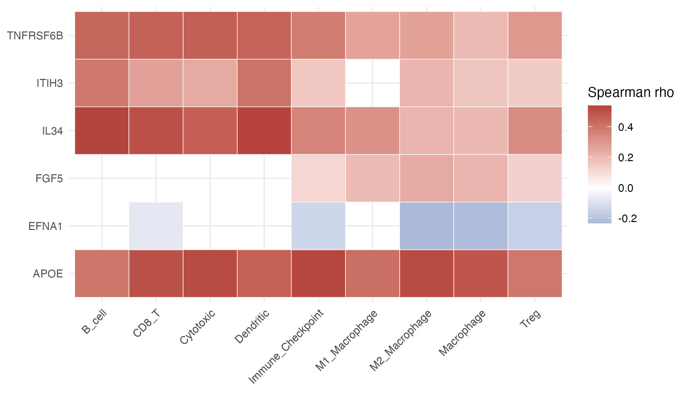{style="max-width:100%; border-radius:8px; box-shadow:0 4px 8px rgba(0,0,0,.12);"}

### CPTAC-BRCA

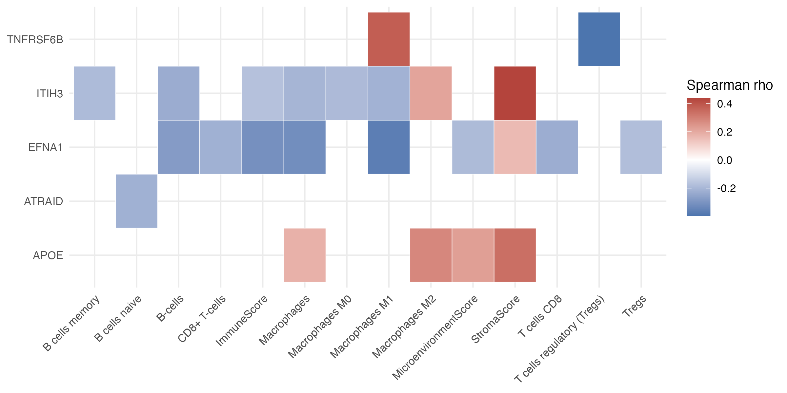{style="max-width:100%; border-radius:8px; box-shadow:0 4px 8px rgba(0,0,0,.12);"}

### TISCH scRNA-seq

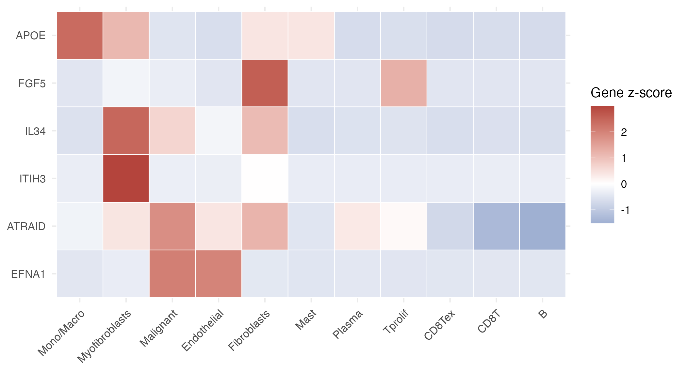{style="max-width:100%; border-radius:8px; box-shadow:0 4px 8px rgba(0,0,0,.12); margin-bottom:20px;"}

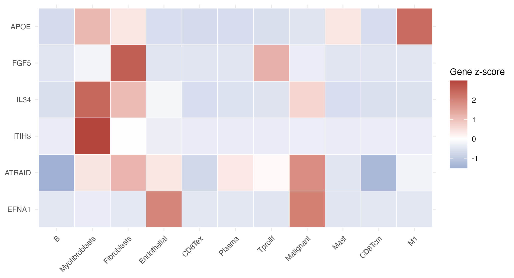{style="max-width:100%; border-radius:8px; box-shadow:0 4px 8px rgba(0,0,0,.12);"}

:::

## Evidence

> Multi-layer evidence for 17 FDR-significant candidates. Colour = tier. Download via buttons above the table.

```{r evidence}
master_ev |>
  select(protein, cancer_mr, tier_short,
         mr_or, mr_or_lo, mr_or_hi, mr_pval, mr_fdr,
         coloc_PPH4_best, coloc_verdict, magma_breast_p) |>
  arrange(tier_short, cancer_mr) |>
  datatable(
    extensions = "Buttons",
    rownames   = FALSE,
    class      = "cell-border stripe hover",
    colnames   = c("Protein", "Cancer", "Tier",
                   "OR", "OR low", "OR high", "P-value", "FDR",
                   "PPH4 (best)", "Coloc verdict", "MAGMA p"),
    options    = dt_opts()
  ) |>
  formatRound(c("mr_or", "mr_or_lo", "mr_or_hi", "coloc_PPH4_best"), digits = 3) |>
  formatSignif(c("mr_pval", "mr_fdr", "magma_breast_p"), digits = 3) |>
  formatStyle("tier_short",
              backgroundColor = styleEqual(names(tier_pal), unname(tier_pal)))
```

## Druggability

```{r druggability}
druggability |>
  select(protein, approved_name, n_known_drugs,
         tractability_SM, tractability_AB,
         top_drug, top_drug_phase, top_indication) |>
  datatable(
    extensions = "Buttons",
    rownames   = FALSE,
    class      = "cell-border stripe hover",
    colnames   = c("Protein", "Gene name", "Known drugs",
                   "SM tractability", "AB tractability",
                   "Top drug", "Phase", "Indication"),
    options    = dt_opts()
  )
```

## Mediation

:::: {.columns}
::: {.column width="58%"}

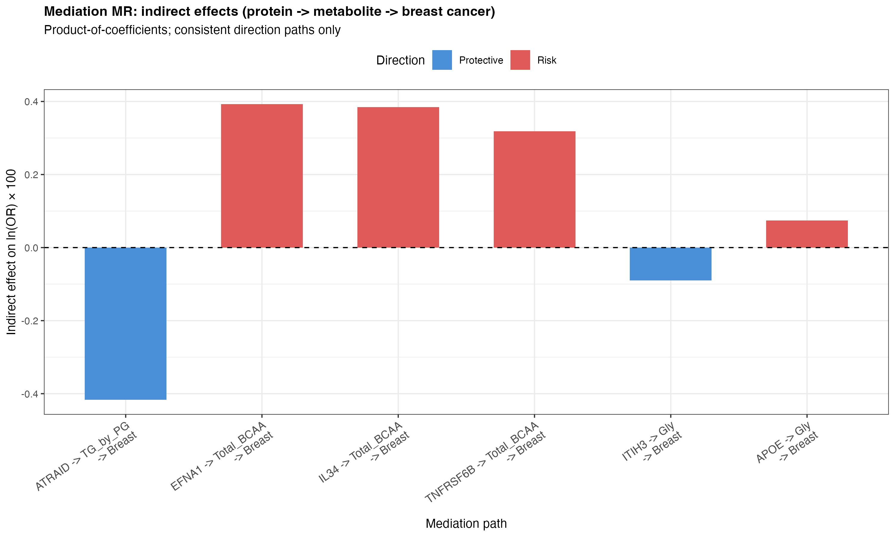{style="max-width:100%; border-radius:8px; box-shadow:0 4px 8px rgba(0,0,0,.12);"}

:::
::: {.column width="4%"}
:::
::: {.column width="38%"}

```{r mediation}
mediation |>
  select(protein, metabolite, cancer,
         p_indirect, prop_med_pct, coloc_evidence_class) |>
  datatable(
    extensions = "Buttons",
    rownames   = FALSE,
    class      = "cell-border stripe hover compact",
    colnames   = c("Protein", "Metabolite", "Cancer",
                   "Indirect p", "% Mediated", "Coloc class"),
    options    = dt_opts(list(pageLength = 6, dom = "Bfrtip",
                              buttons = c("copy", "csv")))
  ) |>
  formatSignif("p_indirect", digits = 3) |>
  formatRound("prop_med_pct", digits = 1)
```

:::
::::

:::
